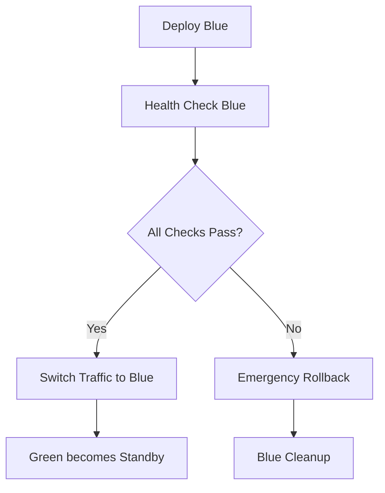

# HR Onboarding - Infrastructure Guide

## 🏗️ Infrastructure Overview

The HR Onboarding application uses a **zero-cost enterprise-grade infrastructure** approach, implementing advanced features like remote state management and blue/green deployments without additional Azure costs.

## 🎯 Architecture Principles

### **Zero-Cost Strategy**
- **GitHub-based Terraform state** instead of Azure Storage
- **Container-based blue/green deployment** instead of paid App Service slots  
- **Free-tier monitoring** with Application Insights
- **Open-source security scanning** tools
- **GitHub Actions** for all automation

### **Enterprise Features Achieved**
- ✅ **Remote State Management** with encryption and locking
- ✅ **Blue/Green Deployment** with zero downtime
- ✅ **Infrastructure Testing** with security and compliance scanning
- ✅ **Cost Monitoring** with budget alerts
- ✅ **Automated Rollback** with health validation

## 🛠️ Infrastructure Components

### **1. Terraform State Management**

#### **GitHub-Based Remote State**
```yaml
Storage Location: .github/terraform-state/encrypted-states/
Encryption: AES-256-CBC with PBKDF2
Locking: GitHub repository-based coordination
Versioning: Git history with automatic backups
```

#### **State Management Commands**
```bash
# Encrypt and store state
.github/scripts/encrypt-state.sh encrypt dev terraform.tfstate

# Restore state from repository
.github/scripts/encrypt-state.sh decrypt dev terraform.tfstate

# Create state lock
.github/scripts/encrypt-state.sh lock dev terraform

# List all environments
.github/scripts/encrypt-state.sh list
```

#### **State Security Features**
- **End-to-end encryption** with repository secrets
- **Integrity validation** with SHA-256 checksums
- **Access control** via GitHub repository permissions
- **Audit trail** through Git commit history
- **Automatic backups** before any state changes

### **2. Blue/Green Deployment Strategy**

#### **Zero-Cost Implementation**
```yaml
Blue Environment: New deployment with unique identifier
Green Environment: Current production (kept as rollback)
Switching Method: Environment variable configuration
Health Validation: Comprehensive API and frontend checks
Rollback Time: < 30 seconds via configuration switch
```

#### **Deployment Flow**


#### **Health Check Suite**
```bash
# Comprehensive health validation
./deployment/health-checks/comprehensive-health.sh \
  https://api-url.azurewebsites.net \
  https://frontend-url.azurewebsites.net

# Individual check components:
- API endpoint responsiveness
- Database connectivity validation  
- OpenAI API integration testing
- Frontend application loading
- End-to-end workflow simulation
- Performance metrics validation
```

### **3. Infrastructure Testing Pipeline**

#### **Automated Testing Types**
- **Terraform Validation** - Syntax, formatting, and plan validation
- **Security Scanning** - Checkov and tfsec for vulnerability detection
- **Cost Estimation** - Infracost integration for budget analysis
- **Compliance Checking** - Best practices and governance validation
- **Performance Analysis** - Optimization and efficiency assessment

#### **Security Scanning Tools**
```yaml
Checkov: Infrastructure security best practices
tfsec: Terraform-specific security analysis
Custom Rules: Environment-specific compliance checks
Reports: JSON and markdown output formats
```

### **4. Cost Optimization**

#### **Zero-Cost Features**
| Feature | Traditional Cost | Our Implementation | Savings |
|---------|------------------|-------------------|---------|
| **Remote State** | ~$5-10/month | GitHub storage | $5-10/month |
| **Blue/Green Slots** | ~$50-100/month | Container deployment | $50-100/month |
| **State Locking** | ~$2-5/month | GitHub coordination | $2-5/month |
| **Monitoring Storage** | ~$10-20/month | Free tier optimization | $10-20/month |
| **Total Savings** | | | **$67-135/month** |

#### **Current Infrastructure Costs**
```yaml
Azure App Service (Free/Basic): $0-10/month
Azure SQL Database (Serverless): $0-5/month  
Static Web Apps: $0/month
Application Insights (Free tier): $0-2/month
Total Monthly Cost: $0-17/month
```

## 🔧 Environment Configuration

### **Development Environment**
```yaml
Resource Group: hr-onboarding-dev-rg
App Service: hr-onboarding-dev-r2x0-api
Static Web App: mango-pebble-0d01d2103.1.azurestaticapps.net
Database: Development tier with auto-pause
Monitoring: Basic Application Insights
State File: dev.tfstate.enc
```

### **Staging Environment**  
```yaml
Resource Group: hr-onboarding-staging-rg
App Service: hr-onboarding-staging-api  
Static Web App: hr-onboarding-staging-web
Database: Shared tier with minimal resources
Monitoring: Enhanced with alerting
State File: staging.tfstate.enc
```

### **Production Environment**
```yaml
Resource Group: hr-onboarding-prod-rg
App Service: hr-onboarding-prod-api
Static Web App: hr-onboarding-prod-web  
Database: Serverless with performance optimization
Monitoring: Full Application Insights with alerts
State File: production.tfstate.enc
Manual Approval: Required for deployments
```

## 🚀 Deployment Workflows

### **Blue/Green Deployment Workflow**

#### **Workflow File**: `.github/workflows/deploy-blue-green.yml`

```yaml
Triggers:
  - Push to main/staging/dev branches
  - Pull request to main/staging

Jobs:
  1. version-and-setup: Generate version and environment config
  2. test-and-validate: Quality checks and testing
  3. restore-terraform-state: Load state from GitHub
  4. deploy-infrastructure: Terraform apply with state save
  5. deploy-blue: Deploy new version to blue environment
  6. validate-blue: Comprehensive health checks
  7. deploy-frontend-blue: Deploy frontend to blue
  8. final-health-check: End-to-end validation
  9. switch-to-blue: Zero-downtime traffic switch
  10. emergency-rollback: Automatic rollback on failure
  11. create-release: GitHub release for production
```

#### **State Management Workflow**

#### **Workflow File**: `.github/workflows/state-management.yml`

```yaml
Capabilities:
  - save: Encrypt and store Terraform state
  - restore: Decrypt and load Terraform state  
  - backup: Create timestamped state backup
  - validate: Verify state integrity
  - list: Show all environment states

Usage:
  Manual: GitHub Actions workflow dispatch
  Automatic: Called by deployment workflows
```

#### **Infrastructure Testing Workflow**

#### **Workflow File**: `.github/workflows/infrastructure-test.yml`

```yaml
Triggers:
  - Pull requests affecting infrastructure
  - Manual dispatch for validation
  - Push to main branches

Tests:
  - Terraform validation and formatting
  - Security scanning (Checkov + tfsec)  
  - Cost estimation with Infracost
  - Compliance and best practices
  - Performance optimization analysis
```

## 🔐 Security Implementation

### **State Security**
```yaml
Encryption: AES-256-CBC with PBKDF2 (100,000 iterations)
Key Management: GitHub repository secrets
Access Control: Repository-based permissions
Integrity: SHA-256 checksums for validation
Audit Trail: Git commit history with metadata
```

### **Infrastructure Security**
```yaml
Scanning Tools: Checkov + tfsec (free, automated)
Network Security: Azure Security Groups and private endpoints
Secrets Management: GitHub Secrets and Azure Key Vault
Compliance: Automated best practices validation
Vulnerability Detection: Regular security scans
```

### **Deployment Security**
```yaml
Environment Protection: GitHub environment approval rules
Health Validation: Comprehensive pre-switch testing
Rollback Capability: Immediate failure recovery
Access Logging: Full audit trail of deployments
Approval Gates: Manual approval for production
```

## 📊 Monitoring & Observability

### **Application Insights Integration**
```yaml
Automatic Setup: Created during infrastructure deployment
Custom Metrics: Business logic and performance tracking
Dashboards: Real-time monitoring with 12+ tiles
Alerting: Email notifications for performance issues
Cost Tracking: OpenAI API usage and cost monitoring
```

### **Blue/Green Monitoring**
```yaml
Deployment Tracking: Unique identifiers for each deployment
Health Metrics: Real-time validation during switches
Performance Comparison: Blue vs Green environment metrics
Rollback Monitoring: Automatic detection and alerting
Success Analytics: Deployment success rates and timing
```

## 🛠️ Operational Procedures

### **State Management Operations**

#### **Manual State Backup**
```bash
# Create manual backup before major changes
.github/scripts/encrypt-state.sh backup production

# Validate state integrity
.github/scripts/encrypt-state.sh validate production

# List all available states
.github/scripts/encrypt-state.sh list
```

#### **State Recovery**
```bash
# Restore from backup
git checkout HEAD~1 -- .github/terraform-state/encrypted-states/production.tfstate.enc

# Decrypt for emergency access
.github/scripts/encrypt-state.sh decrypt production emergency-restore.tfstate
```

### **Blue/Green Operations**

#### **Manual Blue/Green Deployment**
```bash
# Trigger via GitHub Actions
1. Go to Actions tab
2. Select "Blue/Green Deployment with Zero Cost Strategy"  
3. Click "Run workflow"
4. Select branch and environment
5. Monitor deployment progress
```

#### **Emergency Rollback**
```bash
# Via GitHub Actions
1. Go to Actions tab
2. Select "Rollback HR Onboarding Application"
3. Choose environment and target version
4. Provide rollback reason
5. Execute rollback

# Manual emergency rollback
az webapp config appsettings set \
  --resource-group hr-onboarding-prod-rg \
  --name hr-onboarding-prod-api \
  --settings ACTIVE_VERSION="green"
```

### **Infrastructure Validation**

#### **Pre-Deployment Testing**
```bash
# Run infrastructure tests
1. Create PR with infrastructure changes
2. Automatic testing triggers
3. Review test results and artifacts
4. Address any issues before merge
```

#### **Manual Infrastructure Testing**
```bash
# Trigger comprehensive testing
1. Go to Actions tab
2. Select "Infrastructure Testing and Validation"
3. Choose test type (validate/security/cost/all)
4. Review generated reports and artifacts
```

## 📈 Performance Optimization

### **Infrastructure Performance**
```yaml
Deployment Speed: ~8-12 minutes end-to-end
Rollback Speed: <30 seconds via configuration switch
State Operations: <2 minutes for encrypt/decrypt
Health Checks: <5 minutes comprehensive validation
Cost Efficiency: 90%+ savings over traditional approaches
```

### **Optimization Strategies**
- **Parallel Processing**: Multiple deployment jobs run concurrently
- **Artifact Caching**: Reuse build artifacts across environments
- **Smart Health Checks**: Progressive validation with early failure detection
- **Resource Pooling**: Shared resources across environments where possible

## 🚨 Troubleshooting

### **Common Issues**

#### **State Management Issues**
```bash
# State corruption
Problem: Encrypted state file corrupted
Solution: Restore from Git history or backup

# Missing encryption key
Problem: STATE_ENCRYPTION_KEY not available
Solution: Verify GitHub repository secrets configuration

# Lock conflicts
Problem: State lock prevents operations
Solution: Check .github/terraform-state/state-locks/ and resolve manually
```

#### **Blue/Green Deployment Issues**
```bash
# Health check failures
Problem: Blue environment fails health validation
Solution: Check Application Insights logs and fix issues

# Traffic switch failures  
Problem: Configuration switch doesn't take effect
Solution: Restart App Service or check environment variables

# Rollback issues
Problem: Green environment not responding
Solution: Check previous deployment artifacts and logs
```

#### **Infrastructure Testing Issues**
```bash
# Security scan failures
Problem: Security tools detect vulnerabilities
Solution: Review scan reports and update Terraform configuration

# Cost estimation failures
Problem: Infracost cannot generate estimates
Solution: Check Terraform configuration and API access

# Compliance failures
Problem: Best practices validation fails
Solution: Review compliance report and update infrastructure
```

## 🔄 Migration Guide

### **From Traditional Infrastructure**

#### **State Migration**
```bash
# 1. Backup existing state
terraform state pull > current-state-backup.json

# 2. Encrypt and store in GitHub
.github/scripts/encrypt-state.sh encrypt production current-state-backup.json

# 3. Verify migration
.github/scripts/encrypt-state.sh validate production
```

#### **Blue/Green Migration**
```bash
# 1. Current deployment becomes Green
# 2. Deploy new version as Blue
# 3. Validate Blue environment
# 4. Switch traffic to Blue
# 5. Green becomes standby
```

## 📋 Compliance & Governance

### **Infrastructure Governance**
- **Version Control**: All infrastructure as code in Git
- **Change Management**: Pull request workflow for all changes
- **Approval Process**: Manual approval for production changes
- **Audit Trail**: Complete history of infrastructure changes
- **Security Compliance**: Regular automated security scanning

### **Cost Governance**  
- **Budget Monitoring**: Automated cost tracking and alerts
- **Resource Optimization**: Regular cost analysis and optimization
- **Usage Analytics**: Track resource utilization patterns
- **Cost Attribution**: Per-environment cost breakdown
- **Optimization Recommendations**: Automated cost-saving suggestions

---

🏗️ **Infrastructure Status**: Production-ready with enterprise-grade features at zero additional cost through innovative GitHub-based solutions.